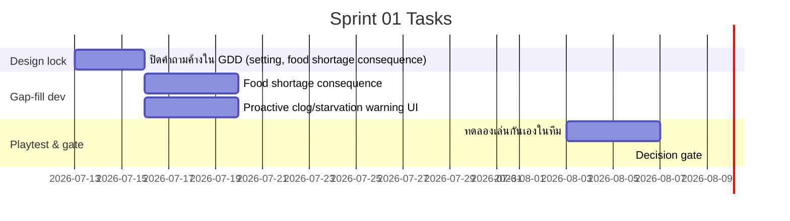

# Sprint 01: Prototype / Vertical Slice

**Goal:** พิสูจน์ว่า core loop "สนุก" ด้วย grayblock — เล่นจบ 1 ด่านได้ตั้งแต่วางแผนถึงจบวัน
**Timeline:** 2026-07-13 → 2026-08-09 (W3–W6)
> Core loop ส่วนใหญ่ถูกสร้างไว้แล้วในโค้ดทดลองก่อนเปิด sprint นี้ (ดู [System Design](../../software/01-system-design.md)) — sprint นี้เน้นปิดช่องว่างที่เหลือ + decision gate ไม่ใช่สร้างใหม่ทั้งหมด

## 📅 Internal Timeline

## 📋 Committed Stories & Tasks

| ID | Story / Task | Owner | Estimate | Status |
|----|--------------|-------|----------|--------|
| [US-CREW-01](../user-stories/US-CREW-01.md) | Hire & manage crew | - | M | ✅ Done (carried over) |
| [US-MISSION-01](../user-stories/US-MISSION-01.md) | Gather/search/hunt missions | - | L | ✅ Done (carried over) |
| [US-TIME-01](../user-stories/US-TIME-01.md) | Day/night cycle | - | M | ✅ Done (carried over) |
| US-BASE-01 | Base attacked at night | - | M | ✅ Done (carried over) |
| US-CLOG-01 | Unused resources decay each day | - | S | ✅ Done (carried over) |
| US-WINLOSE-01 | Win/lose conditions | - | S | ✅ Done (carried over) |
| US-FOOD-01 | Food shortage เกิดผลลบจริง (crew เสีย HP/ประสิทธิภาพ) | - | M | [ ] |
| US-WARN-01 | เตือนผู้เล่นก่อนจบวันถ้าทรัพยากรจะตัน/ขาด | - | S | [ ] |
| — | ปิดคำถามค้างใน [GDD ส่วนที่ยังต้องตัดสินใจ](../../gdd/01-mechanics.md#ส่วนที่ยังต้องตัดสินใจ-ต่อยอดจาก-idea-design-เดิม) | ทั้งทีม | S | [ ] |
| — | ทดลองเล่นกันเองในทีม + เก็บ feedback | ทั้งทีม | S | [ ] |

## 🚦 Decision Gate (สิ้น W6 · 2026-08-09)
Core loop สนุกพอไหม?
→ **สนุก:** ไปเฟส 2 (Production) · **ยัง:** ปรับดีไซน์ก่อน (มี buffer ในแผน)

## 🛠 Sprint Specifics
- **Definition of Done:** ด่านทดลองเล่นได้ตั้งแต่ต้นวันถึงจบวัน โดยไม่ crash, ทีมเล่นจบครบทุกคนอย่างน้อย 1 รอบ
- **Risks & Blockers:**
  - README.md ยังระบุ Unity เป็น engine ทั้งที่ prototype ใช้ Phaser — อาจสร้างความสับสนกับผู้ประเมิน/อาจารย์ ต้องแก้ก่อนส่งงานเฟสนี้
  - คำถามออกแบบหลัก (setting, platform) ยังไม่ปิดอย่างเป็นทางการ แม้ prototype จะเดินหน้าไปแล้ว — เสี่ยง rework ถ้าทีมไม่เห็นตรงกัน

## Related Documents
- [Product Backlog](../01-product-backlog.md)
- [Sprint Planning Overview](../02-sprint-planning.md)
