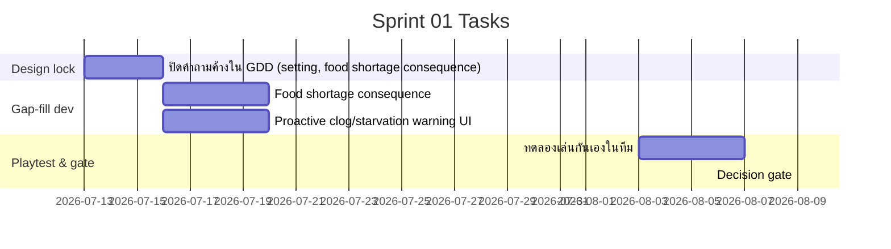

# Sprint 01: Prototype / Vertical Slice

**Goal:** พิสูจน์ว่า core loop "สนุก" ด้วย grayblock — เล่นจบ 1 ด่านได้ตั้งแต่วางแผนถึงจบวัน
**Timeline:** 2026-07-13 → 2026-08-09 (W3–W6)
> Core loop ส่วนใหญ่ถูกสร้างไว้แล้วในโค้ดทดลองก่อนเปิด sprint นี้ (ดู [System Design](../../software/01-system-design.md)) — sprint นี้เน้นปิดช่องว่างที่เหลือ + decision gate ไม่ใช่สร้างใหม่ทั้งหมด

## 📅 Internal Timeline

```mermaid
gantt
    title Sprint 01 Tasks
    dateFormat  YYYY-MM-DD
    section Design lock
    ปิดคำถามค้างใน GDD (setting, food shortage consequence) :a1, 2026-07-13, 3d
    section Gap-fill dev
    Food shortage consequence :a2, 2026-07-16, 4d
    Proactive clog/starvation warning UI :a3, 2026-07-16, 4d
    section Playtest & gate
    ทดลองเล่นกันเองในทีม :a4, 2026-08-03, 4d
    Decision gate: core loop สนุกพอไหม :milestone, 2026-08-09, 0d
```

## 📋 Committed Stories & Tasks

**Sprint Progress:** 🟢 ~88% Completed (Targeting Decision Gate: 2026-08-09)

| ID | Story / Task | Owner | Estimate | Status |
|----|--------------|-------|----------|--------|
| [US-CREW-01](../user-stories/archives/US-CREW-01.md) | Hire & manage crew | ทั้งทีม | M | 🟢 Done |
| [US-MISSION-01](../user-stories/archives/US-MISSION-01.md) | Gather/search/hunt missions | ไอซ์ | L | 🟢 Done |
| [US-TIME-01](../user-stories/archives/US-TIME-01.md) | Day/night cycle | ไอซ์ | M | 🟢 Done |
| [US-TIME-02](../user-stories/US-TIME-02.md) | Day cycle bug fix & clean state reset | ไอซ์ | S | 🟢 Done |
| [US-MISSION-02](../user-stories/US-MISSION-02.md) | Collaborative multi-crew mission system | ไอซ์ | L | 🟢 Done |
| [US-BASE-02](../user-stories/US-BASE-02.md) | Night phase base defense & monster scaling | อั้น/ปาร์ค/ไอซ์ | M | 🟢 Done |
| [US-FOOD-02](../user-stories/US-FOOD-02.md) | Food shortage starvation debuffs & health decay | ไอซ์ | M | 🟡 In Progress |
| [US-MAP-01](../user-stories/US-MAP-01.md) | Dynamic map generation & difficulty scaling | ปาร์ค | M | 🟡 In Progress |
| US-CLOG-01 | Unused resources decay each day | เอก | S | 🟢 Done |
| US-WINLOSE-01 | Win/lose conditions | เอก | S | 🟢 Done |
| US-WARN-01 | เตือนผู้เล่นก่อนจบวันถ้าทรัพยากรจะตัน/ขาด | อั้น | S | 🟡 In Progress |
| [Task Assignment](./2026-08-07-12-task-assignment.md) | สรุปแจกแจงงานรายบุคคล (อั้น, ปาร์ค, เอก, ไอซ์) | ทั้งทีม | M | 🟢 Done |

## 🚦 Decision Gate (สิ้น W6 · 2026-08-09)
Core loop สนุกพอไหม?
→ **สนุก:** ไปเฟส 2 (Production / M2 Presentable Playable Loop) · **ยัง:** ปรับดีไซน์ก่อน (มี buffer ในแผน)

## 🛠 Sprint Specifics
- **Definition of Done:** ด่านทดลองเล่นได้ตั้งแต่ต้นวันถึงจบวัน โดยไม่ crash, ทีมเล่นจบครบทุกคนอย่างน้อย 1 รอบ
- **Risks & Blockers:**
  - การเชื่อมต่อ Scene Flow ใน Unity C# (Day ↔ Night) ต้องทำให้สมบูรณ์เต็มรูปแบบก่อนสปรินท์ถัดไป
  - เอกสาร README.md ต้องปรับปรุงการอธิบาย Phaser prototype และ Unity C# roadmap ให้ชัดเจน

## Related Documents
- [Product Backlog](../01-product-backlog.md)
- [Sprint Planning Overview](../02-sprint-planning.md)
