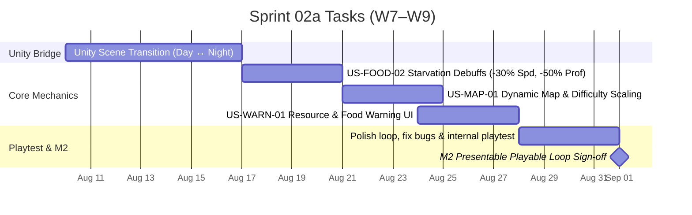

# Sprint 02a: Production Sprint 1 — Presentable Playable Loop

**Goal:** รวมระบบ Unity 2D C# Architecture (Day ↔ Night Bridge) + เติมระบบหลักที่ขาดให้ครบวงรอบ Playable Loop 30 วัน  
**Timeline:** 2026-08-10 → 2026-09-06 (W7–W9)  
**Target Milestone:** [M2 — Presentable Playable Loop (~2026-09-01)](../02-sprint-planning.md#milestones-presentation--presentation-timeline)  

---

## 📅 Timeline Breakdown

---

## 📋 Committed Stories & Tasks

| ID | Story / Task | Owner | Estimate | Status |
|----|--------------|-------|----------|--------|
| **Unity-Bridge** | เชื่อมระบบ `GameManager.cs` ระหว่าง `ShipDay` และ `Night` (`SampleScene.unity`) | อั้น / ปาร์ค | L | ⬜ Not started |
| [US-FOOD-02](../user-stories/US-FOOD-02.md) | Food shortage starvation debuffs (-30% speed, -50% proficiency, HP decay) | ไอซ์ | M | 🟡 In Progress |
| [US-MAP-01](../user-stories/US-MAP-01.md) | Dynamic map generation & distance difficulty scaling ตามวัน | ปาร์ค | M | 🟡 In Progress |
| US-WARN-01 | Proactive warning UI ก่อนจบวันกรณีทรัพยากรล้น/ขาดอาหาร | อั้น | S | 🟡 In Progress |
| **Playtest-M2** | ทดสอบความเสถียรของ Core Loop 30 วันในทีม (ไม่มี crash/ลูปแตก) | ทั้งทีม | M | ⬜ Not started |

---

## 🎯 Definition of Done (M2 Gate)

- ทีมนักเล่นสามารถวิ่ง Core Loop บน Unity Engine ครบ 30 วันโดยไม่มีข้อผิดพลาดร้ายแรง (Crash)
- Multi-crew collaborative mission ทำงานและแสดงผลถูกต้อง
- Base Defense ในฉากกลางคืนมีความยากไต่ระดับตามจำนวนวัน
- อาหารหมดส่งผลกระทบต่อลูกเรือด้วยสถานะ `Starving`
- แผนที่มีการสุ่มความยากกระจายตามระยะทางจากฐาน
- Presentation demo พร้อมส่งมอบแก่อาจารย์/ผู้ประเมิน

---

## 🔗 Related Documents

- [Product Backlog](../01-product-backlog.md)
- [Sprint Planning Overview](../02-sprint-planning.md)
- [Sprint 01 Backlog](./sprint-01.md)
