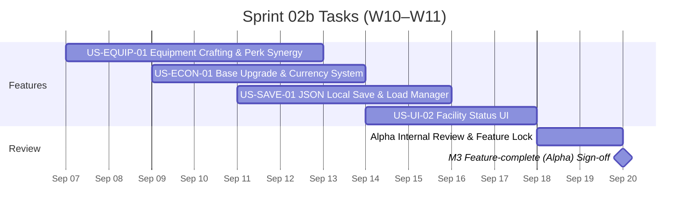

# Sprint 02b: Production Sprint 2 — Feature-complete (Alpha)

**Goal:** พัฒนาระบบอุปกรณ์ (Equipment Crafting), ระบบเศรษฐกิจอัปเกรดฐาน (Currency & Upgrades), และระบบบันทึกสถานะ (Save/Load) เพื่อบรรลุ Feature-complete Alpha  
**Timeline:** 2026-09-07 → 2026-09-20 (W10–W11)  
**Target Milestone:** [M3 — Feature-complete (Alpha) (2026-09-20)](../02-sprint-planning.md#milestones-presentation--presentation-timeline)  

---

## 📅 Timeline Breakdown

---

## 📋 Committed Stories & Tasks

| ID | Story / Task | Owner | Estimate | Status |
|----|--------------|-------|----------|--------|
| [US-EQUIP-01](../user-stories/US-EQUIP-01.md) | Equipment Crafting จากทรัพยากร/ชิ้นส่วนมอนสเตอร์ และระบบสวมใส่ให้ลูกเรือ | ปาร์ค / ไอซ์ | M | ⬜ Backlog |
| US-ECON-01 | ระบบ Currency และการอัปเกรดประสิทธิภาพสิ่งอำนวยความสะดวกในฐาน (Base Facilities) | อั้น | L | ⬜ Backlog |
| US-SAVE-01 | ระบบบันทึกและโหลดเกม (Local JSON Save/Load Persistence) | เอก | M | ⬜ Backlog |
| US-UI-02 | UI แสดงสถานะการทำงานและความสมบูรณ์ของเครื่องจักร/อาคารในฐาน | ไอซ์ | M | ⬜ Backlog |
| **Alpha-Review** | ตรวจสอบระบบ Must Have + Should Have ทั้งหมด ปิด Alpha Build | ทั้งทีม | S | ⬜ Not started |

---

## 🎯 Definition of Done (M3 Alpha Gate)

- ระบบ Must Have และ Should Have ทั้งหมดใน [Product Backlog](../01-product-backlog.md) ถูกพัฒนาลงในเกมครบถ้วน
- ผู้เล่นสามารถสร้างอุปกรณ์ สวมใส่ให้ลูกเรือ และใช้ประโยชน์จาก Perk Synergy ได้
- มีระบบบันทึกและโหลดเกม เล่นต่อจากจุดเดิมได้โดยข้อมูลไม่สูญหาย
- มีระบบ Currency และการอัปเกรดฐานเพิ่มมิติความลึกในการวางแผน
- Alpha Build ถูกส่งมอบเพื่อเข้าสู่เฟส Content & Polish

---

## 🔗 Related Documents

- [Product Backlog](../01-product-backlog.md)
- [Sprint Planning Overview](../02-sprint-planning.md)
- [Sprint 02a Backlog](./sprint-02a.md)
