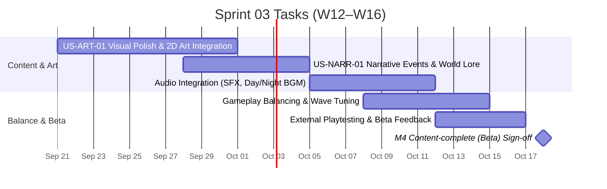

# Sprint 03: Content & Polish — Content-complete (Beta)

**Goal:** เพิ่มเติมเนื้อหาเกม (Monsters, Relics, Crew Perks), นำเข้า Visual & Audio Art Direction, และปรับแต่ง Gameplay Balance ให้สมบูรณ์  
**Timeline:** 2026-09-21 → 2026-10-18 (W12–W16)  
**Target Milestone:** [M4 — Content-complete (Beta) (2026-10-18)](../02-sprint-planning.md#milestones-presentation--presentation-timeline)  

---

## 📅 Timeline Breakdown

---

## 📋 Committed Stories & Tasks

| ID | Story / Task | Owner | Estimate | Status |
|----|--------------|-------|----------|--------|
| US-ART-01 | ปรับปรุง Visual Polish, Sprite Animations, VFX และ UI Themes ตาม Art Direction | ไอซ์ / ปาร์ค | L | ⬜ Backlog |
| US-NARR-01 | นำเข้าเนื้อเรื่อง Narrative Events, บทพูดตัวละคร, และสภาพแวดล้อมโลกตาม Narrative Spec | เอก | S | ⬜ Backlog |
| **Audio-Dev** | นำเข้าไฟล์เสียงประกอบ (SFX ต่อสู้/ทำภารกิจ) และดนตรีฉาก Day/Night (Audio Direction) | อั้น | M | ⬜ Backlog |
| **Balance-Tuning** | ปรับแต่งสมดุลความยาก มอนสเตอร์เวฟ อัตราการดรอปทรัพยากร และค่าพลังลูกเรือ | ทั้งทีม | M | ⬜ Backlog |
| **Beta-Playtest** | เปิดให้กลุ่มผู้เล่นภายนอก/เพื่อนร่วมชั้นทดสอบเล่น เก็บ Feedback สำหรับขัดเกลา | ทั้งทีม | S | ⬜ Not started |

---

## 🎯 Definition of Done (M4 Beta Gate)

- เนื้อหาทั้งหมดของเกม (Monster Types, Node Items, Crew Traits, Audio/SFX) ถูกใส่ครบ 100%
- Visual Polish และ UI Design ตรงตามมาตรฐาน [Art Direction](../../gdd/03-art-direction.md)
- Audio system (SFX + Music) ทำงานตอบสนองกับทุก Action ในเกม
- Gameplay ผ่านการปรับแต่งสมดุล (Game Balance) ไม่ยากหรือง่ายเกินไปตลอด 30 วัน
- Beta Build พร้อมสำหรับการทดสอบขั้นสุดท้าย (QA & Release Prep)

---

## 🔗 Related Documents

- [Product Backlog](../01-product-backlog.md)
- [Sprint Planning Overview](../02-sprint-planning.md)
- [Sprint 02b Backlog](./sprint-02b.md)
- [GDD Art Direction](../../gdd/03-art-direction.md)
- [GDD Audio Direction](../../gdd/04-audio-direction.md)
