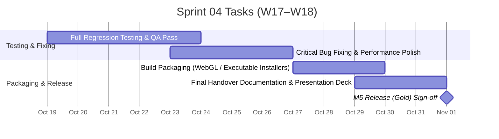

# Sprint 04: Test & Release — Release Build (Gold)

**Goal:** ดำเนินการทดสอบอย่างครบถ้วน (Full Regression Testing), แก้ไขบั๊ก, เพิ่มประสิทธิภาพ (Performance Optimization), และจัดทำ Release Build ส่งมอบโครงการ  
**Timeline:** 2026-10-19 → 2026-11-01 (W17–W18)  
**Target Milestone:** [M5 — Release (Gold) (2026-11-01)](../02-sprint-planning.md#milestones-presentation--presentation-timeline)  

---

## 📅 Timeline Breakdown

---

## 📋 Committed Stories & Tasks

| ID | Story / Task | Owner | Estimate | Status |
|----|--------------|-------|----------|--------|
| **QA-Pass** | ทดสอบระบบย้อนหลังอย่างละเอียด (Full Regression Testing) ตาม [Testing Guidelines](../../wiki/guidelines/system-test-guideline.md) | ทั้งทีม | M | ⬜ Not started |
| **Optimization** | เพิ่มประสิทธิภาพการทำงานของเกม (Frame rates, Memory consumption, Asset loading times) | อั้น / ปาร์ค | M | ⬜ Not started |
| **Bug-fixing** | จัดการ Bug และ Edge cases ทั้งหมดที่พบใน Beta test ให้เหลือน้อยที่สุด (Zero Critical Bugs) | ทั้งทีม | M | ⬜ Not started |
| **Build-Packaging** | จัดทำแพ็กเกจ Release Build สำหรับเผยแพร่ (Standalone Desktop Executable & WebGL Build) | เอก | S | ⬜ Not started |
| **Final-Presentation** | จัดทำเอกสารสรุปโครงการ สไลด์นำเสนอ และคู่มือส่งมอบงาน (Final Handover Deck) | ทั้งทีม | S | ⬜ Not started |

---

## 🎯 Definition of Done (M5 Gold Gate)

- ไม่พบ Critical / High Severity Bugs ในระบบ
- Performance ของเกมทำงานได้อย่างราบรื่น 60 FPS บนสเปกเป้าหมาย
- Release Build ถูกแพ็กเกจอย่างสมบูรณ์ พร้อมติดตั้งหรือเล่นบนเบราว์เซอร์
- มีคู่มือการเล่นและเอกสารส่งมอบโครงการ (Handover Docs) ครบถ้วน
- ผ่านการนำเสนอส่งมอบโครงการอย่างเป็นทางการ (Project Sign-off)

---

## 🔗 Related Documents

- [Product Backlog](../01-product-backlog.md)
- [Sprint Planning Overview](../02-sprint-planning.md)
- [Sprint 03 Backlog](./sprint-03.md)
- [Testing Guidelines](../../wiki/guidelines/system-test-guideline.md)
