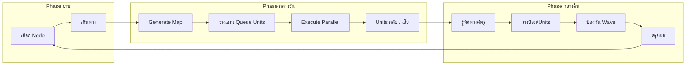
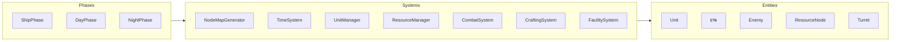

# clogged — Game Concept & Architecture

**Version:** 0.3 | **Last Updated:** 2026-07-24 | **Owner:** ทีม clogged (เอก, อั้น, ไอซ์, ปาร์ค)

## 1. Introduction

### Elevator Pitch
ผู้เล่นควบคุมยานอวกาศที่ถูก "Clogged" ด้วยภัยคุกคามจากภายนอก ต้องเลือกเส้นทางเดินทางผ่าน Node Map แบบ Roguelike แล้วส่ง Units ออกไปสำรวจและเก็บทรัพยากรในเวลากลางวัน ก่อนจะป้องกันยานจาก Wave ศัตรูและบอสในเวลากลางคืน จนกว่าจะปราบบอสใหญ่ทั้ง 3 ตัว

แนวคิดหลัก: การวางแผนระยะสั้น (Time Management + Assignment) + การป้องกันระยะยาว (Tower Defense) ภายใต้แรงกดดันของทรัพยากรที่จำกัดและความเสี่ยงที่จะสูญเสีย Units

### Target Audience
- ผู้เล่นที่ชอบ FTL: Faster Than Light, Against the Storm, They Are Billions, Loop Hero, หรือ Blue Archive แนววางแผน
- อายุ 16+ ที่ชอบความท้าทายจากการจัดการเวลา/ความเสี่ยง และความพึงพอใจจากการป้องกันสำเร็จ

### Genre & Platform
- **Genre:** Turn-based Strategy / Resource Management + Tower Defense Hybrid (Roguelike structure)
- **Perspective:** Top-down (Day Map + Night Defense) + Node Graph (Ship Phase)
- **Platform:** PC (Steam) เป็นหลัก, รองรับ Controller; Mobile อาจเป็นเวอร์ชันย่อในอนาคต
- **Session Length:** 1 รอบ (3 Boss) ≈ 45–90 นาที (Roguelike run)

### Unique Selling Points (USP)
- ระบบ 3 Phase ที่ชัดเจนและเปลี่ยนจังหวะเกม (Strategy → Management → Defense)
- Time System ที่ทำให้การส่ง Units ไปเก็บของมีความเสี่ยงจริง (ไม่กลับ = เสีย Unit)
- การวางแผนป้องกัน 4 ทิศทางพร้อมกัน + Main Gun ที่ผู้เล่นควบคุมเอง
- Units ที่มีทั้งความสามารถ (Passive Bonus) และความถนัด (Speed / Rate Multiplier) ทำให้มี build diversity

---

## 2. Design Evolution

| เวอร์ชัน | แนวทาง | ที่มา |
|---------|--------|------|
| Draft ดั้งเดิม | Factory / Conveyor pipeline — ต่อสายการผลิต/สมการเคมี | [Idea & Design Draft](../wiki/archive/idea-design-draft.md) |
| v1.0 (Prototype) | Resource Management + Action Survival — ส่งลูกเรือออกภารกิจ day/night cycle | โค้ด prototype `prototype_resource_game/src/` |
| **v0.3 (ปัจจุบัน)** | **Turn-based Strategy / Resource Management + Tower Defense Hybrid — 3 Phase (Ship → Day → Night) + Node Map Roguelike** | Google Doc — [Clogged_GDD_v0.3](https://docs.google.com/document/d/1SGxMLKs7FlRq_E-0OHyskQbingBxaU5L/edit) |

> การอัปเกรดเป็น v0.3 นี้เป็นวิวัฒนาการต่อจาก prototype ที่มีอยู่ โดยเพิ่มโครงสร้าง Node Map, 3-Phase loop, และระบบ Tower Defense ที่ชัดเจนขึ้น

---

## 3. Technical Stack

| Layer | Technology | Notes |
|-------|-----------|-------|
| Engine | Phaser 3 (v4.0 package) | 2D scene-based game engine |
| Language | TypeScript ~5.7 | |
| Build tool | Vite ^6.3 | dev/prod config แยกไฟล์ใน `vite/` |
| Renderer | Phaser Arcade | ยังไม่มี sprite art — ใช้ primitive shapes + emoji |

---

## 4. Game Collection / Features

- **3-Phase Gameplay Loop:** Ship (Navigation) → Day (Management) → Night (Defense)
- **Node Map Roguelike:** 3 Layers × 5 Blocks, Nodes หลากหลายประเภท (ธรรมดา, บอส, ร้านค้า, Encounter, พิเศษ)
- **Day Phase — Time Management:** Units เดินทางบน Continuous Coordinate Map ด้วยระบบ Queue + Time Pool (Distance / Speed)
- **Night Phase — Tower Defense:** ป้องกันยาน 4 ทิศทาง (N/S/E/W) ด้วย Main Gun + ป้อม + กับดัก + Units
- **Unit System:** ความสามารถ (Traits), ความถนัด (Specialty Multiplier), Equipment + Relic
- **Resource System:** 4 ประเภทหลัก (Energy, Material, Bio, Rare) + Boss Material
- **Crafting & Upgrade:** อุปกรณ์ Units, ป้อมชั่วคราว, กับดัก, Facility
- **Facility System:** Assign Units เพื่อรับ Passive Bonus (Bridge, Workshop, Medbay, Scout Bay)
- **Progression:** ภายใน Run (เก็บ Resource → Craft/Upgrade → ปราบบอส) + ระหว่าง Run (Roguelike Meta)

---

## 5. System Architecture

### 3-Phase Flow

### โครงสร้างโดยรวม

---

## Related Documents
- Mechanics: [Core Mechanics](01-mechanics.md)
- Product Backlog: [Product Backlog](../agile/01-product-backlog.md)
- Roadmap: [Sprint Planning](../agile/02-sprint-planning.md)
- Team: [Team Roster](../agile/team.md)
