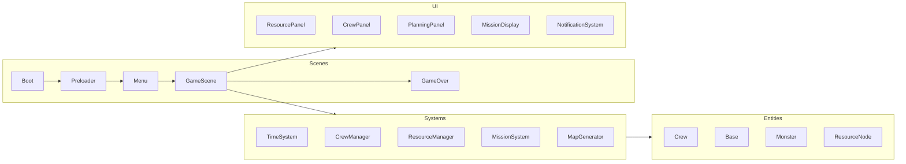

# clogged — Game Concept & Architecture

**Version:** 1.1 | **Last Updated:** 2026-07-13 | **Owner:** ทีม clogged (เอก, อั้น, ไอซ์, ปาร์ค)

## 1. Introduction

### Elevator Pitch
**clogged** เป็นเกม **Resource Management ผสม Action Survival** ที่เน้นการออกแบบและพัฒนาระบบ (systems-driven) มากกว่าเนื้อเรื่องหรือกราฟิก ผู้เล่นบริหารฐาน (Base) และทีมลูกเรือ (Crew) ที่มีจำกัด ส่งออกไปเก็บทรัพยากร ค้นหาโบราณวัตถุ และล่ามอนสเตอร์ในตอนกลางวัน แล้วป้องกันฐานจากการโจมตีในตอนกลางคืน ผ่านไปให้ได้ 30 วันโดยฐานไม่พังและลูกเรือไม่ตายหมด

ชื่อ *clogged* (อุดตัน) คือธีมหลักของเกม — ทรัพยากรที่บริหารไม่ดีจะ **"อุดตัน" (เก็บมากเกินใช้ แล้วเน่าเสีย/หายไปครึ่งหนึ่งเมื่อจบวัน)** หรือ **"ขาด" (ไม่พอสำหรับเลี้ยงลูกเรือ)** — ผู้เล่นต้องบาลานซ์การไหลของทรัพยากรให้พอดี ไม่ตันไม่ขาด

### Target Audience
ผู้เล่นที่ชอบเกมบริหารจัดการ/วางแผน (management & optimization) แนว survival-crew-management (เทียบเคียง FTL, This War of Mine, Oregon Trail) — เปิดกว้างทั้ง casual และ hardcore optimizer เพราะระบบรองรับทั้งเล่นเอาตัวรอดและเล่นเพื่อ optimize ประสิทธิภาพ

> ⚠️ **หัวข้อยังไม่ล็อกอย่างเป็นทางการ** — plan.md เฟส 0 ระบุว่าต้องตอบให้ครบก่อนเข้าเฟส 1 แต่จากโค้ด prototype ปัจจุบันคำตอบโดยพฤตินัยคือด้านบน ทีมควรยืนยัน/ปรับในที่ประชุมและอัปเดตเอกสารนี้

---

## 2. ⚠️ Design Pivot — บันทึกไว้เพื่อความชัดเจน

แนวทางที่ระบุใน [Idea & Design Draft เดิม](../wiki/archive/idea-design-draft.md) (การไหลของทรัพยากรผ่านท่อ/สายพาน แบบ factory-pipeline) **ไม่ตรงกับสิ่งที่ prototype ปัจจุบันสร้างจริง**

| ประเด็น | ร่างเดิม (Idea-design.md) | ที่ Prototype สร้างจริง (พ.ค. 2026) |
|---|---|---|
| แกนเกม | Resource Management + **Factory** (ต่อสายการผลิต/สมการเคมี) | Resource Management + **Action Survival** (ส่งลูกเรือออกภารกิจ) |
| การไหลของทรัพยากร | ท่อ/สายพาน เชื่อม node → node | ลูกเรือเดินทางไป-กลับระหว่าง Base กับ resource node |
| Core challenge | ท่อตัน/ล้นจากการต่อระบบผิด | ทรัพยากรเก็บเกินใช้แล้ว **เน่าเสียครึ่งหนึ่งทุกจบวัน** + อาหารขาดเลี้ยงลูกเรือไม่พอ |
| โครงสร้างรอบเล่น | ไม่ระบุ | **Day/Night cycle**: กลางวัน = วางแผน+ปฏิบัติภารกิจ, กลางคืน = มอนสเตอร์บุกฐาน |

การเปลี่ยนทิศทางนี้สอดคล้องกับ [Meeting Note รอบที่ 2 (29 มิ.ย. 2026)](../agile/meeting-backlogs/2026-06-29-resource-management.md) ที่ "ยืนยันแนวทางหลักเป็น Resource Management ผสมกับแนว Action Survival" — **เอกสารนี้ยึดตามสิ่งที่ prototype สร้างจริงเป็นหลัก** ไม่ใช่ร่างไอเดียเดิม ทีมควรตรวจสอบว่าการตัดสินใจนี้เป็นเจตนา แล้วปิด choice ใน [plan.md เฟส 0](../agile/02-sprint-planning.md) ให้ตรงกัน

---

## 3. Technical Stack

| Layer | Technology | Notes |
|-------|-----------|-------|
| Engine | [Phaser 3](https://phaser.io/) (v4.0 package) | 2D scene-based game engine |
| Language | TypeScript ~5.7 | |
| Build tool | Vite ^6.3 | dev/prod config แยกไฟล์ใน `vite/` |
| Renderer | Phaser Arcade (Arc/Text game objects) | ยังไม่มี sprite art — ใช้ primitive shapes + emoji |

> ⚠️ **ขัดแย้งกับ README.md เดิม** ที่ระบุ Engine เป็น Unity — README ควรอัปเดตให้ตรงกับ Phaser/TS ที่ใช้จริงใน `prototype_resource_game/`

---

## 4. Game Collection / Features (สรุปจาก prototype)

- ระบบลูกเรือ (Crew) — สุ่มคุณสมบัติ/perk, จ้างด้วย point, ส่งไปทำภารกิจได้ทั้งเดี่ยวและกลุ่ม (collaborative mission)
- ระบบภารกิจ (Mission) — เก็บทรัพยากร / ค้นหาโบราณวัตถุ (relic) / ล่ามอนสเตอร์ พร้อมกลไก "เวลาไม่พอ" ที่ให้ผลลัพธ์บางส่วนแทนที่จะ fail เฉยๆ
- ระบบทรัพยากร (Resource) — 7 ชนิด (wood, stone, iron, food, water, circuit, aluminum) + monster parts (fangs/hides/claws) + relics
- ระบบเวลา/วัน-คืน (Time/Day-Night) — วางแผน → ดำเนินภารกิจ (จำกัดเวลาต่อวัน) → กลางคืนป้องกันฐาน
- ระบบฐาน (Base) — มี HP, ถูกมอนสเตอร์โจมตีตอนกลางคืน
- Win/Lose — ดูรายละเอียดใน [01-mechanics.md](01-mechanics.md)

รายละเอียดกลไกเต็มดูที่ [Core Mechanics](01-mechanics.md)
รายละเอียดโครงสร้างโค้ดดูที่ [System Design](../software/01-system-design.md)

---

## 5. System Architecture

ดูรายละเอียดทั้งหมดใน [Software — System Design](../software/01-system-design.md) และ [Class Diagram](../software/02-class-diagram.md)

ภาพรวมระดับสูง:

---

## Related Documents
- Mechanics: [Core Mechanics](01-mechanics.md)
- Software: [System Design](../software/01-system-design.md)
- Backlog: [Product Backlog](../agile/01-product-backlog.md)
- Roadmap: [Sprint Planning](../agile/02-sprint-planning.md)
- Team: [Team Roster](../agile/team.md)
