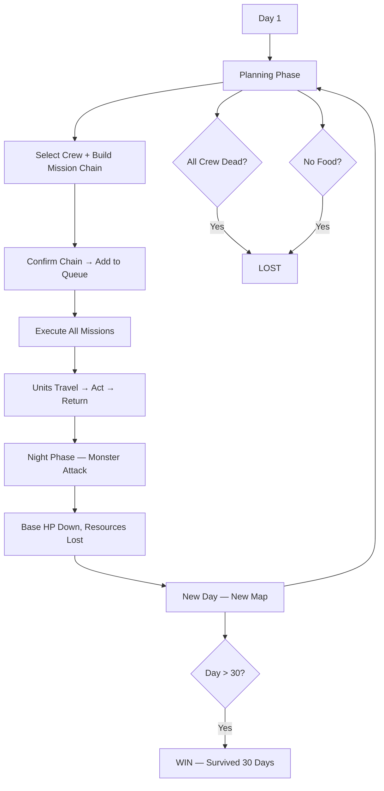
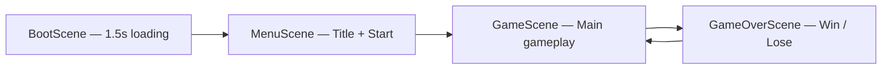
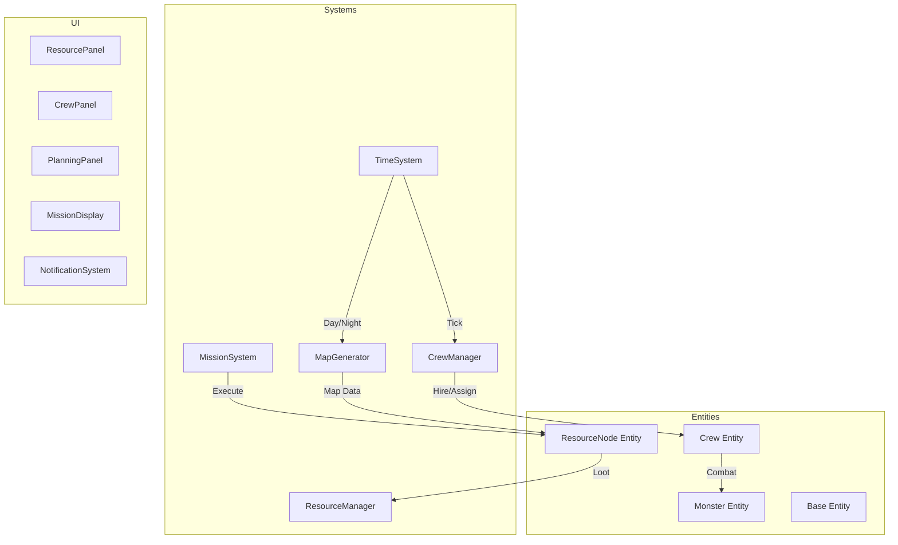

# Survival Base — Game Concept & Architecture

**Version:** 1.0 (Prototype) | **Last Updated:** 2026-07-30 | **Owner:** ทีม clogged

## 1. Introduction

### Elevator Pitch
ผู้เล่นต้องกำกับการดำรงรอดของฐานพึ่งพาตนเองในภูมิภาคร้อนรัง โดยส่งเหล่ามืออาชีพออกเก็บทรัพยากร ค้นหารีลิกส์โบราณ และล่าสัตว์ประหลาดในเวลากลางวัน ก่อนจะป้องกันฐานจากคลาสัตว์ประหลาดในเวลากลางคืน เป้าหมายคือการรอดชีวิต 30 วันในภูมิภาคที่ไม่มีความปราณี

**คำถ้าหลัก:** จัดการทรัพยากรและเวลาอย่างไรให้รอด 30 วัน โดยไม่ให้ฐานถูกทำลาย ไม่ให้คนอดอาหาร และไม่ให้ทุกคนตาย

### Target Audience
- เกมเมอร์ที่ชอบ survival / resource management / time management (FTL, Barotrauma, They Are Billions, State of Decay)
- วัย 16+ ที่ชอบการวางแผนและจัดการทรัพยากรจำกัด

### Genre & Platform
- **Genre:** Real-time Strategy + Resource Management + Base Defense (Action Survival)
- **Perspective:** Top-down, continuous coordinate map
- **Platform:** PC Browser (HTML5 / Phaser 3)
- **Session Length:** 1 Run = 30 วัน ≈ 10–20 นาที (prototype)

### Unique Selling Points (USP)
- ระบบ **Mission Chain** — ส่ง Crew ไปหลายจุดต่อเนื่องกันในคิวเดียว ไม่ต้องส่งทีละคั้น
- ระบบ **Collaboration** — หลาย Crew ทำงานที่จุดเดียวกันพร้อมกัน แล้วรวมความถนัด
- **Day/Night Pressure** — กลางวันมีเวลาจำกัด กลางคืนถูกโจมตี ไม่สามารถ interrupt ระหว่าง execution ได้
- **Perk + Equipment Synergy** — Crew แต่ละตัวมีความถนัดเฉพาะที่ทำงานร่วมกันกับ equipment ได้

---

## 2. Game Loop

```mermaid
flowchart TD
    A[Day 1] --> B[Planning Phase]
    B --> C[Select Crew + Build Mission Chain]
    C --> D[Confirm Chain → Add to Queue]
    D --> E[Execute All Missions]
    E --> F[Units Travel → Act → Return]
    F --> G[Night Phase — Monster Attack]
    G --> H[Base HP Down, Resources Lost]
    H --> I[New Day — New Map]
    I --> B
    I --> J{Day > 30?}
    J -->|Yes| K[WIN — Survived 30 Days]
    B --> L{All Crew Dead?}
    L -->|Yes| M[LOST]
    B --> N{No Food?}
    N -->|Yes| M
```

---

## 3. Technical Stack

| Layer | Technology | Notes |
|-------|-----------|-------|
| Engine | Phaser 3 (v4.0) | Scene-based 2D game engine |
| Language | TypeScript ~5.7 | |
| Build | Vite ^6.3 | dev / prod configs in `vite/` |
| Renderer | Phaser Arcade Physics | Grid-free, continuous coordinates |
| UI | Pure Phaser GameObjects | No external UI framework |
| Platform | Browser (HTML5) | Runs via `npm run dev` (Vite dev server) |

---

## 4. Game Architecture

### Scene Flow

```mermaid
flowchart LR
    Boot[BootScene — 1.5s loading] --> Menu[MenuScene — Title + Start]
    Menu --> Game[GameScene — Main gameplay]
    Game --> Over[GameOverScene — Win / Lose]
    Over --> Game
```

### Scene Responsibilities

| Scene | Responsibility |
|-------|---------------|
| **BootScene** | แสดง loading animation, หน่วง 1.5s แล้วไป MenuScene |
| **MenuScene** | Title screen, decorative arcs, feature list, Start button |
| **GameScene** | ทุกอย่าง: map, crews, missions, time, night defense, UI |
| **GameOverScene** | แสดงผลชนะ/แพ้, day count, restart button |

### Core Systems (GameScene)

```mermaid
flowchart TD
    subgraph Systems
        TimeSys[TimeSystem]
        CrewMgr[CrewManager]
        ResMgr[ResourceManager]
        MissionSys[MissionSystem]
        MapGen[MapGenerator]
    end

    subgraph Entities
        Crew[Crew Entity]
        ResourceNode[ResourceNode Entity]
        Monster[Monster Entity]
        Base[Base Entity]
    end

    subgraph UI
        ResourcePanel
        CrewPanel
        PlanningPanel
        MissionDisplay
        NotificationSystem
    end

    TimeSys -->|Tick| CrewMgr
    CrewMgr -->|Hire/Assign| Crew
    MissionSys -->|Execute| ResourceNode
    ResourceNode -->|Loot| ResMgr
    TimeSys -->|Day/Night| MapGen
    MapGen -->|Map Data| ResourceNode
    Crew -->|Combat| Monster
```

---

## 5. System Overview

### Time System
- วนลูป 30 วัน (day 1 → day 30)
- วันละ 1 รอบ: **Day Phase** (plan + execute) → **Night Phase** (defense)
- Day time limit: 12000 time units
- Simulation tick: +100 units every 1 second (real-time simulation)
- Night duration: 5 seconds (short, transitions quickly)

### Mission System
- 3 ประเภท: **Gather**, **Relic Search**, **Monster Hunt**
- ผู้เล่น build mission chain: Crew → Target 1 → Target 2 → ... → Base
- Each mission phase: Travel → Action → Travel back
- Collaborative mode: หลาย crew ไปจุดเดียวกัน → ใช้ total proficiency

### Resource System
- 7 resources: Wood, Stone, Iron, Food, Water, Circuit, Aluminum
- Monster parts: Fangs, Hides, Claws
- Base HP: 100, decreases from night attacks
- Food consumed daily per crew (2 food/crew/day)

### Win / Lose Conditions

| Condition | Result |
|-----------|--------|
| Survive 30 days | **WIN** |
| Base HP ≤ 0 | **LOST** — Base Destroyed |
| Food ≤ 0 | **LOST** — Starvation |
| All crews dead | **LOST** — No one left |

---

## 6. Design Evolution

| Version | Concept | Source |
|---------|---------|--------|
| **v1.0 Prototype** | Resource Management + Action Survival — send crew for missions in day, defend base at night | Source code `prototype_resource_game/` |
| v0.3 Concept | Turn-based Strategy + Tower Defense Hybrid — 3 Phase (Ship → Day → Night) + Node Map Roguelike | [Clogged_GDD_v0.3](https://docs.google.com/document/d/1SGxMLKs7FlRq_E-0OHyskQbingBxaU5L/edit) |

> Prototype นี้เป็นการ test concept ของ v1.0 ที่ได้ระบุไว้ใน Design Evolution — ตรวจสอบว่าการส่ง crew ออกไป mission + ป้องกัน night ให้ความรู้สึก "survival pressure" แบบไหน

---

## Related Documents
- Mechanics: [Core Mechanics](01-mechanics.md)
- System Design: [System Design](../software/01-system-design.md)
- Product Backlog: [Backlog](../agile/01-product-backlog.md)