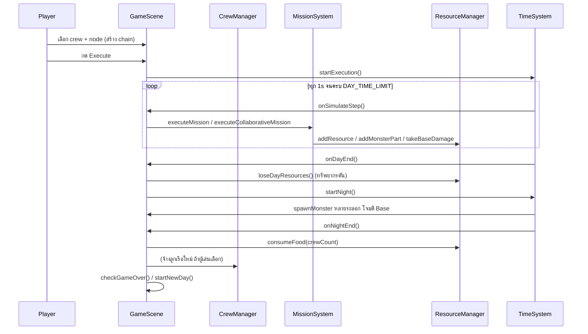

# clogged — System Design

**Version:** 1.0 | **Last Updated:** 2026-07-13
> สร้างจากการอ่านโค้ดจริงใน `prototype_resource_game/src/` (Phaser 3 + TypeScript + Vite)

## 1. Project Structure

```
prototype_resource_game/src/
├── config.ts            ← GAME_CONFIG (ตัวเลข balance ทั้งหมด), RESOURCE_ICONS/TYPES
├── main.ts               ← Phaser.Game bootstrap
├── data/                 ← ข้อมูลนิ่ง (templates, constants)
│   ├── Constants.ts       (COLORS, CREW_NAMES, PERKS, MONSTER_NAMES)
│   ├── CrewData.ts         (CREW_TEMPLATES — ลูกเรือตั้งต้น)
│   └── ResourceData.ts     (RESOURCE_DATA, RELIC_DATA, MONSTER_DATA)
├── entities/             ← Object ที่มีสถานะในเกม
│   ├── Base.ts, Crew.ts, Monster.ts, ResourceNode.ts
├── systems/              ← Logic ไม่ผูกกับการวาดภาพ
│   ├── TimeSystem.ts, CrewManager.ts, ResourceManager.ts
│   ├── MissionSystem.ts, MapGenerator.ts
├── scenes/               ← Phaser Scene lifecycle
│   ├── BootScene, Preloader, MenuScene, GameScene, GameOverScene
├── ui/                   ← Phaser display objects ที่ผูกกับ system data
│   ├── ResourcePanel, CrewPanel, PlanningPanel
│   ├── MissionDisplay, NotificationSystem, UIManager
└── utils/                ← Helpers.ts, RandomGenerator.ts
```

**หลักการแบ่งชั้น:** `entities` = state + คำนวณค่าของตัวเอง (ไม่รู้จัก scene), `systems` = orchestration ข้าม entity (ไม่วาดอะไร), `scenes/GameScene` = wiring ทุกอย่างเข้าด้วยกัน + input handling, `ui/*` = อ่าน system state มาวาด ไม่ถือ business logic

## 2. Subsystem Breakdown

### TimeSystem
คุมสถานะ planning/executing/night phase และนับเวลาใน 1 วัน ยิงคอลแบ็ก `onDayEnd` / `onNightEnd` / `onSimulateStep` ให้ `GameScene` — ไม่รู้จัก resource/crew ใดๆ (pure timing)

### ResourceManager
เก็บ inventory 7 ชนิดทรัพยากร + monster parts + base HP เมธอดหลัก: `addResource`, `consumeFood` (คืน shortage), `loseDayResources` (กลไก "clog" — หายครึ่งตอนจบวัน), `takeBaseDamage`

### CrewManager
วงจรชีวิตลูกเรือ: generate → hire → assign mission (ย้ายจาก `availableCrews` → `busyCrews`) → complete mission (ย้ายกลับ) ไม่รู้เรื่อง mission logic เอง แค่ track สถานะ busy/available

### MissionSystem
รับ `Crew`(s) + `ResourceNode` target คำนวณ travel/action time เทียบกับ `DAY_TIME_LIMIT` แล้ว dispatch ไปยัง private handler ตามประเภท target (`executeGathering` / `executeRelicSearch` / `executeMonsterHunt`) และเวอร์ชัน collaborative ของแต่ละแบบ คืนผล `MissionResult` ให้ scene ไปอัปเดต UI/notification — เป็นระบบที่ใหญ่และซับซ้อนที่สุด (มี logic ซ้ำกันมากระหว่าง solo/collaborative — ผู้สมัครที่ดีสำหรับ refactor ในเฟส 2)

### MapGenerator
สุ่มตำแหน่ง Base + resource node/relic/monster node บนแมป โดยเว้นระยะขั้นต่ำจาก Base (`minDistance`)

### GameScene (orchestrator)
เป็นจุดเดียวที่ผูกทุก system + entity + ui เข้าด้วยกัน, จัดการ input (เลือก crew/node, keyboard shortcuts), คุม mission queue (`QueuedMission[]`) และ game-over check ปัจจุบันมีขนาดใหญ่ (1000+ บรรทัด) — ควรพิจารณาแยกความรับผิดชอบ (input handling / queue processing / rendering) เมื่อเข้าเฟส 2 Production

## 3. Data Flow — 1 รอบวัน



## 4. Known Technical Debt (สังเกตจากโค้ด)

- `MissionSystem` มี solo vs collaborative handler แยกกันสมบูรณ์ (โค้ดซ้ำ ~4 ชุด) — รวมเป็น generic function ที่รับ `Crew[]` เดียวได้
- `GameScene` ทำหน้าที่เกินขอบเขต scene (input + queue orchestration + rendering) — ควรแตกเป็น controller/manager แยกเมื่อ scope โตขึ้นในเฟส 2
- Food shortage คำนวณไว้แต่ยังไม่มีผลลบต่อเกม (ดู [Mechanics — ส่วนที่ยังต้องตัดสินใจ](../gdd/01-mechanics.md#ส่วนที่ยังต้องตัดสินใจ-ต่อยอดจาก-idea-design-เดิม))

## Related Documents
- [Class Diagram](02-class-diagram.md)
- [Core Mechanics](../gdd/01-mechanics.md)
