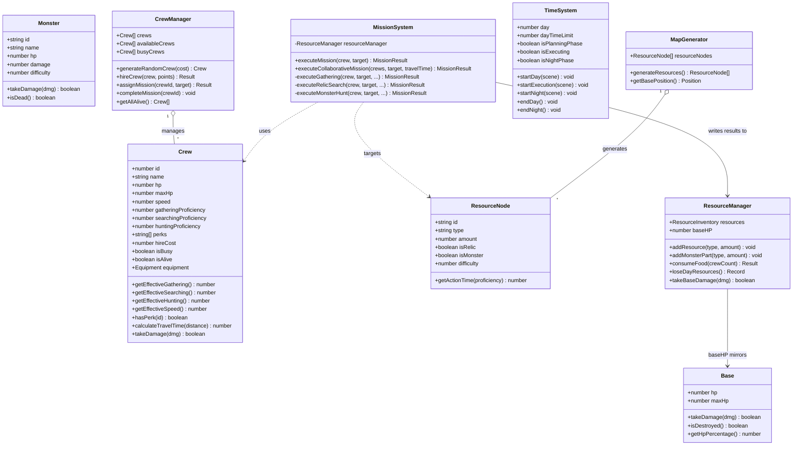

# clogged — Class Diagram

**Version:** 1.0 | **Last Updated:** 2026-07-13
> ครอบคลุม `entities/` และ `systems/` เท่านั้น (ไม่รวม Phaser scene/UI classes ซึ่งเป็น glue code) — สร้างจากโค้ดจริงใน `prototype_resource_game/src/`

## Notes

- `MissionSystem` ไม่ hold state ของ `Crew`/`ResourceNode` เอง — รับเป็น parameter ทุกครั้ง (stateless orchestrator)
- `Base.hp` และ `ResourceManager.baseHP` เป็นสอง representation ของค่าเดียวกันในโค้ดปัจจุบัน (`Base` entity ถูกสร้างแต่ scene ใช้ `resourceManager.baseHP` เป็นค่าจริงที่แสดงผล) — ควร unify เป็นแหล่งเดียวเมื่อ refactor เฟส 2 เพื่อลดความเสี่ยง state ไม่ตรงกัน
- `Equipment` (weapon/armor/accessory) นิยามไว้ใน `Crew.ts` แต่ยังไม่มี system ใดสร้าง/มอบ equipment ให้ลูกเรือ — เป็น stub รอฟีเจอร์ในอนาคต

## Related Documents
- [System Design](01-system-design.md)
- [Core Mechanics](../gdd/01-mechanics.md)
