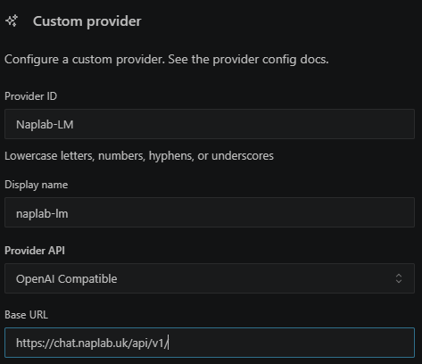

# Naplab AI Provider Setup

> บันทึกค่า config ของ AI Provider "Naplab AI" (local vLLM) สำหรับใช้งานกับ AI client เช่น Kilo
> Setup date: 2026-08-07

## ข้อมูล Provider

| Field        | Value                                   |
| ------------ | --------------------------------------- |
| Provider ID  | `naplab-ai`                           |
| Display name | Naplab-LM                               |
| Provider API | OpenAI Compatible                       |
| Base URL     | `https://chat.naplab.uk/api/v1/`      |
| API Key      | `sk-5547f0465c3d41c79f2a61a21c0517a0` |

## Models

| ID                   | Name                                                                                 |
| -------------------- | ------------------------------------------------------------------------------------ |
| `ornith-1.0-35b`   | ornith / Ornith 1.0 35B (base model)                                                 |
| `camt-dg`          | DG 2562 Curriculum (preset ครอบ `ornith-1.0-35b` + knowledge หลักสูตร) |
| `camtdg-local-llm` | CAMTDG Local LLM (preset ครอบ `ornith-1.0-35b`)                                |

> หมายเหตุ: endpoint `/v1/models` ยังคืน `arena-model` (โหมด Open WebUI Arena สำหรับโหวตเปรียบเทียบ chatbot) มาด้วย แต่ไม่ใช่โมเดลที่เรียกใช้ตรงๆ ผ่าน API ได้ จึงไม่ได้เพิ่มเข้า config

## การตั้งค่าใน Kilo (`.kilo/kilo.jsonc`)

Provider นี้ถูกตั้งค่าไว้แล้วที่ root ของโปรเจกต์ในไฟล์ [`.kilo/kilo.jsonc`](../../../.kilo/kilo.jsonc):

```jsonc
{
  "provider": {
    "naplab": {
      "name": "Naplab AI",
      "options": {
        "baseURL": "https://chat.naplab.uk/api/v1/",
        "apiKey": "sk-5547f0465c3d41c79f2a61a21c0517a0"
      },
      "models": {
        "ornith-1.0-35b": {
          "name": "Ornith 1.0 35B",
          "tool_call": true,
          "limit": {
            "context": 128000,
            "output": 8192
          }
        },
        "camt-dg": {
          "name": "DG 2562 Curriculum",
          "tool_call": true,
          "limit": {
            "context": 128000,
            "output": 8192
          }
        },
        "camtdg-local-llm": {
          "name": "CAMTDG Local LLM",
          "tool_call": true,
          "limit": {
            "context": 128000,
            "output": 8192
          }
        }
      }
    }
  }
}
```

> ⚠️ **หมายเหตุความปลอดภัย:** API Key ด้านบนถูก commit ไว้ใน repo แล้ว (`.kilo/kilo.jsonc`) — หากเป็น key จริงที่ใช้งานในระบบ production ควรพิจารณาย้ายไปเก็บใน environment variable หรือ secret manager แทนการ hardcode/commit ลง git




## Reference

- Endpoint: https://chat.naplab.uk/api/v1/
- ดูวิธีเชื่อม MCP/AI client อื่นๆ เพิ่มเติมได้ที่ [Unity MCP Setup Guide](unity-mcp-setup.md)
