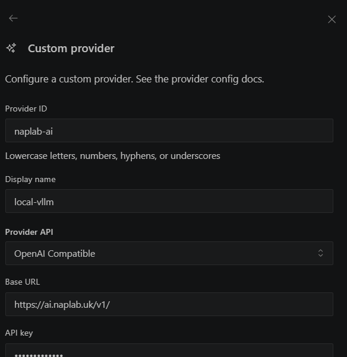
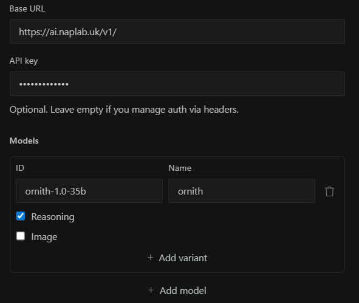
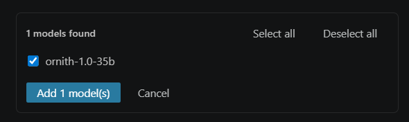

# Naplab AI Provider Setup

> บันทึกค่า config ของ AI Provider "Naplab AI" (local vLLM) สำหรับใช้งานกับ AI client เช่น Kilo
> Setup date: 2026-08-07

## ข้อมูล Provider

| Field        | Value                        |
| ------------ | ---------------------------- |
| Provider ID  | `naplab-ai`                |
| Display name | `local-vllm`               |
| Provider API | OpenAI Compatible            |
| Base URL     | `https://ai.naplab.uk/v1/` |
| API Key      | `naplabcamtcmu`            |

## Models

| ID                 | Name   |
| ------------------ | ------ |
| `ornith-1.0-35b` | ornith |

## การตั้งค่าใน Kilo (`.kilo/kilo.jsonc`)

Provider นี้ถูกตั้งค่าไว้แล้วที่ root ของโปรเจกต์ในไฟล์ [`.kilo/kilo.jsonc`](../../.kilo/kilo.jsonc):

```jsonc
{
  "provider": {
    "naplab": {
      "name": "Naplab AI",
      "options": {
        "baseURL": "https://ai.naplab.uk/v1",
        "apiKey": "naplabcamtcmu"
      },
      "models": {
        "ornith-1.0-35b": {
          "name": "Ornith 1.0 35B",
          "tool_call": true,
          "limit": {
            "context": 128000,
            "output": 8192
          }
        }
      }
    }
  }
}
```

> ⚠️ **หมายเหตุความปลอดภัย:** API Key ด้านบนถูก commit ไว้ใน repo แล้ว (`.kilo/kilo.jsonc`) — หากเป็น key จริงที่ใช้งานในระบบ production ควรพิจารณาย้ายไปเก็บใน environment variable หรือ secret manager แทนการ hardcode/commit ลง git







## Reference

- Endpoint: https://ai.naplab.uk/v1/
- ดูวิธีเชื่อม MCP/AI client อื่นๆ เพิ่มเติมได้ที่ [Unity MCP Setup Guide](unity-mcp-setup.md)
